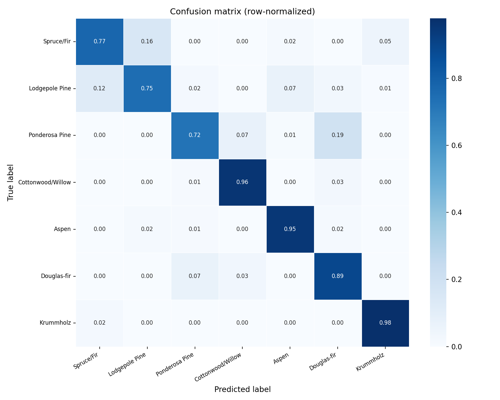
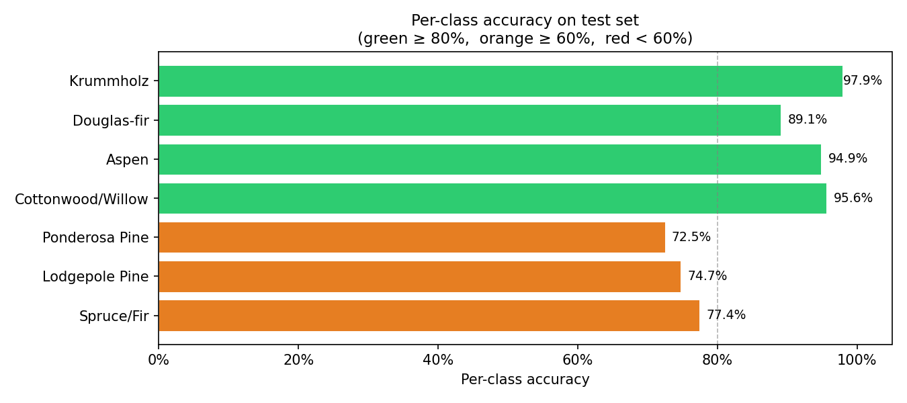

# 🌲 Forest Cover Type Classification
### Deep Learning with TensorFlow & Keras


---

## Overview

This project applies deep learning to predict **forest cover type** — the dominant tree species — for 30×30 meter cells in the Roosevelt National Forest of northern Colorado. Using only cartographic variables derived from USGS and US Forest Service data, a multi-class neural network classifier is trained to distinguish between seven cover types with no manual feature engineering.

The dataset originates from the **UCI Machine Learning Repository** and contains over 580,000 samples across 54 features, making it a strong benchmark for evaluating classification models on large, imbalanced tabular data.

---

## Cover Types

| Class | Cover Type         |
|-------|--------------------|
| 1     | Spruce/Fir         |
| 2     | Lodgepole Pine     |
| 3     | Ponderosa Pine     |
| 4     | Cottonwood/Willow  |
| 5     | Aspen              |
| 6     | Douglas-fir        |
| 7     | Krummholz          |

---

## Project Structure

```
forest_ml/
├── config.py            # Central configuration — all paths, constants, hyperparameters
├── load_data.py         # Data loading, summary statistics, exploration plots
├── preprocessing.py     # Stratified splitting, StandardScaler, class weight computation
├── model.py             # Keras DNN architecture, callbacks, training, persistence
├── tuning.py            # Automated hyperparameter search (RandomSearch + Hyperband)
├── evaluate.py          # Test set evaluation, confusion matrix, per-class metrics
├── plot_history.py      # Training history plots from TensorBoard event logs
├── main.py              # Single CLI entry point for the full pipeline
├── cover_data.csv       # Raw dataset (not tracked in git — see Data section)
├── saved_models/        # Trained model checkpoints and scaler
└── plots/               # All generated figures
```

---

## Model Architecture

A feed-forward deep neural network with three hidden layers, built with the Keras functional API:

```
Input (54 features)
  └─ Dense(256) → BatchNormalization → ReLU → Dropout(0.3)
  └─ Dense(128) → BatchNormalization → ReLU → Dropout(0.3)
  └─ Dense(64)  → BatchNormalization → ReLU → Dropout(0.3)
  └─ Dense(7)   → Softmax
```

**Total parameters:** 57,031 (~222 KB)

Key design decisions:
- **BatchNormalization** after each Dense layer stabilizes gradients across the mixed feature space (scaled continuous + binary columns)
- **Dropout(0.3)** prevents overfitting to the dominant majority classes
- **Class weights** computed inversely proportional to class frequency — Cottonwood/Willow (0.5% of data) receives 30× the gradient weight of Lodgepole Pine
- **`sparse_categorical_crossentropy`** loss handles integer labels directly with no one-hot encoding required

---

## Results

Evaluated on a stratified held-out test set of **87,152 samples** (15% of data, never seen during training or tuning).

### Per-Class Accuracy

| Cover Type        | Accuracy | 
|-------------------|----------|
| Krummholz         | **97.9%** |
| Cottonwood/Willow | **95.6%** |
| Aspen             | **94.9%** |
| Douglas-fir       | **89.1%** |
| Spruce/Fir        | 77.4%    |
| Lodgepole Pine    | 74.7%    |
| Ponderosa Pine    | 72.5%    |

### Confusion Matrix


### Per-Class Accuracy Chart


### Key Observations

- The three rarest classes (Krummholz, Cottonwood/Willow, Aspen) achieved the highest accuracy — a direct result of class-weight balancing during training
- The primary source of confusion is between **Spruce/Fir and Lodgepole Pine** (16% cross-confusion), and **Ponderosa Pine and Douglas-fir** (19% cross-confusion) — species pairs that share overlapping elevation and slope ranges in the real world, making cartographic separation inherently difficult
- Krummholz achieves near-perfect accuracy because it only grows at high elevations near treeline — a distinctive cartographic signature the model learns reliably

---

## Hyperparameter Tuning

Hyperparameter optimization was performed using **Keras Tuner** with two strategies:

- **RandomSearch** — 10 trials exploring the full search space
- **Hyperband** — bracket-based early elimination for faster convergence

Search space:

| Hyperparameter   | Range              |
|------------------|--------------------|
| Hidden layers    | 2 – 4              |
| Neurons per layer| 64, 128, 256, 512  |
| Dropout rate     | 0.1 – 0.5          |
| Learning rate    | 1e-4 – 1e-2 (log)  |

Training used four callbacks: `EarlyStopping`, `ModelCheckpoint`, `ReduceLROnPlateau`, and `TensorBoard`.

---

## Setup & Usage

### 1. Clone the repository
```bash
git clone https://github.com/your-username/forest-cover-classification.git
cd forest-cover-classification
```

### 2. Create a virtual environment and install dependencies
```bash
python3 -m venv venv
source venv/bin/activate        # Windows: venv\Scripts\activate
pip install -r requirements.txt
```

### 3. Add the dataset
Download `cover_data.csv` from the [UCI Machine Learning Repository](https://archive.ics.uci.edu/ml/datasets/covertype) and place it in the project root.

### 4. Run the pipeline

```bash
# Full pipeline: explore → train → tune → evaluate
python3 main.py

# Individual modes
python3 main.py --mode explore    # Data exploration + plots only
python3 main.py --mode train      # Train baseline model + evaluate
python3 main.py --mode tune       # Hyperparameter search + evaluate best model
python3 main.py --mode evaluate   # Evaluate a saved model on the test set
```

---

## Requirements

```
tensorflow>=2.13
keras-tuner
scikit-learn
pandas
numpy
matplotlib
seaborn
joblib
```

Install all at once:
```bash
pip install -r requirements.txt
```

---

## Data

The dataset is sourced from the **UCI Machine Learning Repository**:
> Blackard, J. A., & Dean, D. J. (1999). *Comparative accuracies of artificial neural networks and discriminant analysis in predicting forest cover types from cartographic variables.* Computers and Electronics in Agriculture, 24(3), 131–151.

581,012 samples · 54 features · 7 classes · No missing values

**Features include:**
- 10 continuous cartographic variables (Elevation, Slope, Aspect, distances to hydrology/roads/fire points, hillshade indices)
- 4 binary wilderness area indicators (one-hot encoded)
- 40 binary soil type indicators (one-hot encoded)

The dataset is not included in this repository due to size. Download it from the link above and place `cover_data.csv` in the project root, or update `DATA_PATH` in `config.py` to point to your local copy.

---

## Design Philosophy

This project was built with clean, modular code as a core principle. Each file has a single clear responsibility — configuration, loading, preprocessing, modelling, tuning, and evaluation are fully decoupled. All behaviour is controlled through `config.py` so no implementation files need to be edited to change hyperparameters, paths, or split ratios. The `main.py` entry point wires all modules together through a simple CLI, making the pipeline reproducible from a single command.

---

## License

This project is licensed under the MIT License. See [LICENSE](LICENSE) for details.
